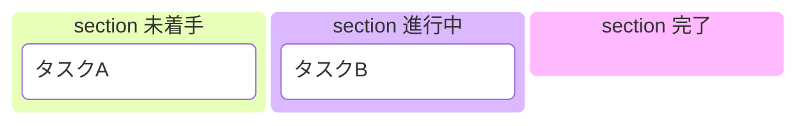

# Phase: design (2)

## Scope
- この工程のスコープを明記

## Plan
- [ ] タスクA (due::2025-05-10)
- [ ] タスクB (due::2025-05-20)

## Notes
- 決定事項やメモ

## Risks
- リスクと対策

---
## Kanban（メンバー向け）

```mermaid
kanban
  section 未着手
    タスクA
  section 進行中
    タスクB
  section 完了
```
